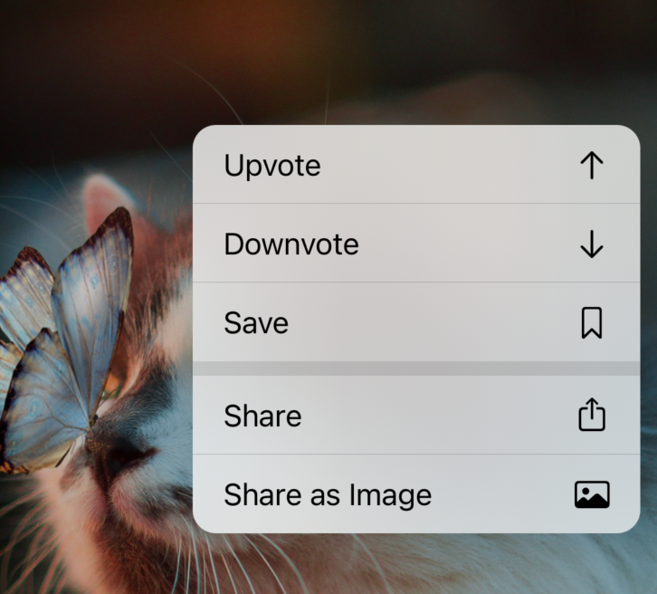
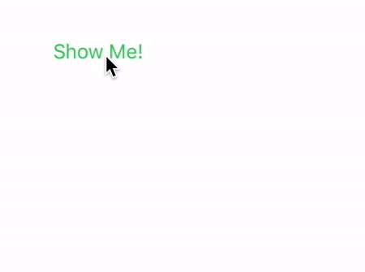

# ChidoriMenu 🐦⚡️

An easy way to add popover menus visually similar to the [Context Menus](https://developer.apple.com/design/human-interface-guidelines/ios/controls/context-menus/) and [Pull Down Menus](https://developer.apple.com/design/human-interface-guidelines/ios/controls/pull-down-menus/) iOS uses but with some advantages. (Effectively just a rebuild of Pull Down Menus as a custom view controller to gain some flexibility.)



### Why?

- Pull Down menus were introduced in iOS 14, and look great, effectively marrying UIActionController and Context Menus from iOS 13, but are only available on iOS 14. This library works on iOS 13 as well.
- Even with an iOS 14 only target, the Pull Down Menus API is a little rigid for how I personally would like to use it, where it needs to be paired with a component like a `UIButton`. Further, if it's not a `UIButton` or `UIBarButtonItem` (which have an easy to use, direct `menu` property), such as an arbitrary `UIControl`, it seemingly requires subclassing the `UIControl` and implementing some methods. This doesn't work for me because A) I don't control all of my `UIControl` subclasses (some are handy ones from libraries) and B) even if I did, I still couldn't present it from say, an arbitrary `UITapGestureRecognizer` (to my knowledge).

All that to say I wanted a system that didn't care where it came from, or require any special delegate method implementation, similar to how `UIActionController` (in action sheet mode), just presents it from a location on screen, and have it work on iOS 13 as well as a bonus, so I don't have to juggle two systems (`UIAlertController` on iOS 13, and `UIMenu` on iOS 14).

### Installation

Just drop the Swift files in the *Source* directory into your project (with the except of `ExampleViewController.swift` unless you want that). Nothing fancy. 🙂

### How to Use

It's meant to basically be dropped in and used right away with an existing `UIMenu` you have, say for a long-press context menu preview interaction in iOS 13 and higher, so you can use one menu for both.

Sample usage:

```swift
override func viewDidLoad() {
    super.viewDidLoad()
    
    let tapGestureRecognizer = UITapGestureRecognizer(target: self, action: #selector(tapped(tapGestureRecognizer:)))
    view.addGestureRecognizer(tapGestureRecognizer)
}

@objc private func tapped(tapGestureRecognizer: UITapGestureRecognizer) {
    let tappedPoint = tapGestureRecognizer.location(in: view)
    
    let chidoriMenu = ChidoriMenu(menu: sampleMenu, summonPoint: tappedPoint)
    chidoriMenu.delegate = self
    present(chidoriMenu, animated: true, completion: nil)
}

private lazy var sampleMenu: UIMenu = {
    var postActions: [UIAction] = []

    let upvoteIdentifier = UIAction.Identifier("upvote")
    let upvoteAction = UIAction(title: "Upvote", image: UIImage(systemName: "arrow.up"), identifier: upvoteIdentifier, handler: upvote(action:))
    postActions.append(upvoteAction)

    let downvoteIdentifier = UIAction.Identifier("downvote")

    let downvoteAction = UIAction(title: "Downvote", image: UIImage(systemName: "arrow.down"), identifier: downvoteIdentifier, handler: downvote(action:))
    postActions.append(downvoteAction)

    let saveIdentifier = UIAction.Identifier("save")
    
    let saveAction = UIAction(title: "Save", image: UIImage(systemName: "bookmark"), identifier: saveIdentifier, handler: save(action:))
    postActions.append(saveAction)
    
    let postMenu = UIMenu(title: "", image: nil, identifier: nil, options: [.displayInline], children: postActions)
    return postMenu
}()

private func save(action: UIAction) {
    print("Save called")
}
```

Rather than pass a closure into the `handler` property of `UIAction`, functions in Swift are first class values so I just pass in the method that it should call. 

This leads into the main gotcha, in that the `handler` isn't accessible after the fact, so this library can't call it automatically (I couldn't find a nice way that didn't feel super fragile or likely to leak memory), so implement the `ChidoriDelegate` method and call the corresponding action there.

In my app I do this by having a top level dictionary mapping of the identifiers to their corresponding function, that way calling it in the delegate is super simple.

So for instance the upvote action would now look like this, storing the corresponding function:

```swift
let upvoteIdentifier = UIAction.Identifier("upvote")
actionMappings[upvoteIdentifier] = upvote(action:) // <-- secret sauce addition
let upvoteAction = UIAction(title: "Upvote", image: UIImage(systemName: "arrow.up"), identifier: upvoteIdentifier, handler: downvote(action:))
postActions.append(upvoteAction)
```

And then in the delegate method:

```swift
var actionMappings: [UIAction.Identifier: UIActionHandler] = [:]

func didSelectAction(_ action: UIAction) {
    actionMappings[action.identifier]?(action)
}
```

Easy peasy. And I'm pretty dang sure there's no retain cycle issues here, as you're only storing a reference to the function to be called, not actually anything within the function itself.

### Gotchas

- Doesn't support nested menus. It will display everything as if the `.displayInline` attribute is enabled.
- Requires the passed `UIMenu`'s children to be either entirely `UIAction`s (for just a normal list of actions) or entirely `UIMenu`s (for a list of actions separated into submenus, again, like `.displayInline`). Don't mix `UIAction` and `UIMenu` into the same array (if you're doing that currently, just wrap the `UIActions` into a `UIMenu` before passing).
- As mentioned in *How to Use* above, it doesn't just leverage the `handler` property of the `UIAction` because iOS doesn't expose the `handler` method `UIAction` is created. So rather than duplicate code, separate out your method and call it inside handler (will work for context menus) and then also call it in the corresponding delegate method for this library.
- Requires iOS 13. iOS 12 would have been cool, but `UIMenu` requires iOS 13 or higher and I didn't want to have a separate backing model, and I wouldn't be able to use SF Symbols, which are really nice to have for this.

### Missing Thing That if You're a Pro I'd Greatly Appreciate Help/Insight Into

Custom view controller transitions are hard. One thing I'm jealous of with Apple's Pull Down Menu implementation that I can't quite lock down with mine is that their view controller presentation is completely interruptable, you can tap outside the menu ***while it's being presented*** and it'll cancel the presentation and just return to square one. I cannot figure out how to do this for the life of me. Is it really important? No, not really, the animation is 0.4 seconds long, I doubt people would really notice, but it's bugging me deeply, I love that fluid nature of iOS animations. Here's a GIF showing what I mean (Slow Animations is enabled in iOS Simulator to make it easier to see):



This library just uses a standard, non-interactive view controller transition to present the menu, but if anyone can figure out how to transform the current implementation into one that is interruptable, you'd be my favorite iOS developer in the world. 

For some more details on this, I wrote on my blog about my trials and tribulations trying to achieve this with interruptibleAnimators, interactive transitions, and more, to no avail: 

[https://christianselig.com/2021/02/interruptible-view-controller-transitions/](https://christianselig.com/2021/02/interruptible-view-controller-transitions/)
